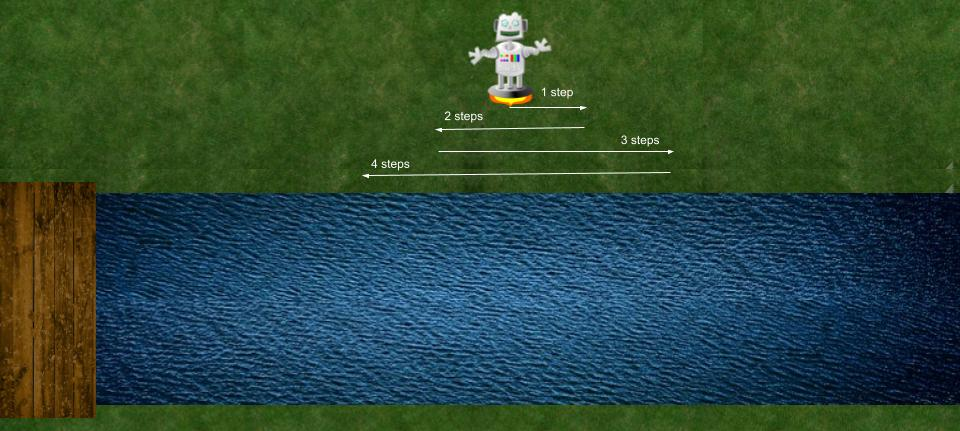
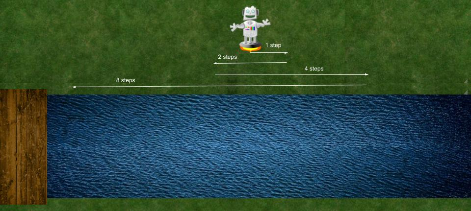
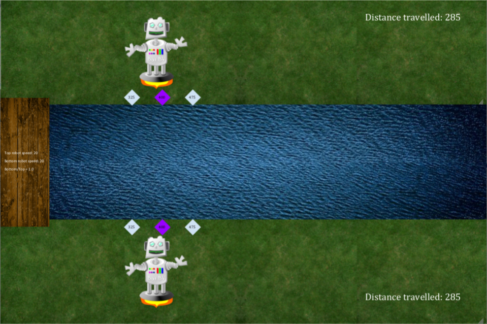

# Bridge-Finding-Robots

<h1> The Problem (credit: Gr. 12 CS class)</h1>

Problem: Let's say you were a robot trying to find a bridge in a dark forest at night. You can only see a tiny bit ahead of you, and you know that the bridge is either straight east or straight west relative to your current position.

How do you go about finding the bridge? Here are two ways.

<h2> Way 1: Constant growth in both directions </h2>

<h2> Way 2: Exponential growth in both directions </h2>

 <i>Bridge-Finding Robots</i> Provides a side by side comparison of the two methods. It demonstrates <i>algorithm analysis</i> in a visually appealing way.
  

  The top robot uses the Constant Growth algorithm while the bottom robot uses the Exponential Growth algorithm.  

<h2>Features</h2>

The program enables you to 

  
