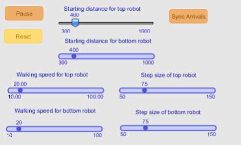

# Bridge-Finding-Robots

 <i>Bridge-Finding Robots</i> compares two algorithms for solving a cool thinking problem. 

<h1> The Problem (credit: Gr. 12 CS class)</h1>

Problem: Let's say you were a robot trying to find a bridge at night. You can only see a tiny bit ahead of you, and you know that the bridge is either straight east or straight west of your current position.

How do you go about finding the bridge? Here are two ways.

<h2> Way 1: Constant growth in both directions </h2>

 Using this method, or <i>algorithm</i>, you would go 1 step east, then 2 steps west, then 3 steps east, then 4 steps west etc until you have reached the bridge. 

<h2> Way 2: Exponential growth in both directions </h2>

 Using this algorithm, you would go 1 step east, then 2 steps west, then 4 steps east, then 8 steps west etc until you have reached the bridge. 

<h2>Which way is better?</h2>

 <i>Bridge-Finding Robots</i> provides a side by side comparison of the two algorithms. It demonstrates <i>algorithm analysis</i> visually.
 
 

  The top robot uses the Constant Growth algorithm while the bottom robot uses the Exponential Growth algorithm.  

<h2>Features</h2>

The program enables you to set each robot's starting distance from the bridge, walking speed, and step size. You can also use the <i>Sync</i> feature to sync the robots' arrivals.

<h2>Demo</h2>

 As you can see, in the first run, the top robot embarasses the bottom robot. In the second run, the <i>Sync</i> feature is activated, which raises the speed of the bottom robot to make up for its inefficient algorithm.
  
